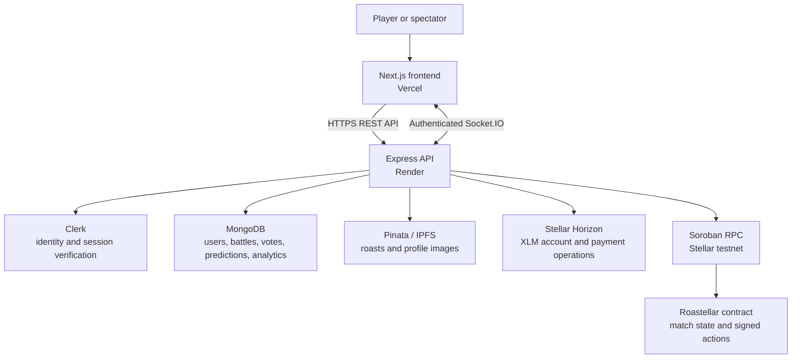

# Roastellar architecture

Roastellar is a production MVP for two-player roast battles on Stellar testnet. The web application combines a responsive Next.js client, an authenticated Node.js API with real-time battle updates, MongoDB application data, Pinata/IPFS content storage, and a Soroban contract for signed battle lifecycle actions.

## System context



## Component responsibilities

| Component | Responsibility |
|---|---|
| **Frontend** | Provides onboarding, wallet, dashboard, battle, leaderboard, profile, metrics, and report pages. It renders loading/error states and calls the API through a typed/normalised client. |
| **Express API** | Applies authentication, input validation, rate limits, battle orchestration, payment/contract integrations, report generation, and public metrics. |
| **Socket.IO** | Authenticates connections and pushes lobby and battle-room updates without relying on client-side polling alone. |
| **MongoDB** | Stores the application read model: users, battles, vote and prediction records, analytics events, and transaction/report metadata. |
| **Pinata/IPFS** | Stores CID-addressed roast/topic content and approved profile image uploads. |
| **Stellar testnet** | Provides account/payment operations through Horizon and signed Soroban contract interactions through RPC. |
| **Soroban contract** | Enforces contract-level match creation, joining, roast submission, voting, predictions, finalisation, and badge state. |

## Frontend

The frontend is a Next.js 16 App Router application written in TypeScript. Clerk protects application routes; Freighter support is available for Stellar wallet sign-in and use.

### Main routes

| Route | Purpose |
|---|---|
| `/` | Entry point that directs authenticated users to their next required step. |
| `/sign-in`, `/sign-up` | Clerk authentication. New-user errors are redirected to sign-up. |
| `/onboarding` | Creates or connects a wallet and completes the onboarding flow. |
| `/dashboard`, `/battles`, `/battle/[id]` | Battle discovery, creation/joining, live battle participation, voting, and predictions. |
| `/battle/[id]/report` | Protected historical battle report: players, votes, predictions, payouts, and transaction ledger. |
| `/profile` | Profile editing, Pinata-backed avatar upload, previous matches, and sharing. |
| `/wallet`, `/leaderboard`, `/metrics` | Wallet information, rankings, and public usage metrics. |

### Client integration pattern

- `Frontend/src/lib/api.ts` centralises API routes, authentication headers, response normalisation, battle-report types, and analytics metrics requests.
- `Frontend/src/lib/socket.ts` manages authenticated Socket.IO updates for live battles.
- The battle page requests the authenticated participation status after load, so vote and prediction locks persist after refresh.
- The responsive layout uses a desktop sidebar and mobile-oriented navigation/components.

## Backend

The backend runs Node.js with Express, Socket.IO, Mongoose, Zod, and the Stellar SDK.

### API modules

| Prefix | Responsibility |
|---|---|
| `/api/auth` | Wallet challenge/verification and wallet-session issuance. A Freighter login resolves an existing linked Google account before creating a wallet-only identity. |
| `/api/clerk` | Clerk webhook ingestion; mounted before JSON parsing so signature verification can use the raw body. |
| `/api/users` | Current user, profile updates, Pinata avatar upload, match history, and leaderboard data. |
| `/api/wallet` | Managed wallet creation, balance retrieval, testnet funding, and controlled secret export. |
| `/api/battles` | Create, join, submit roast, vote, finalise/cancel, participation status, open battles, and protected reports. |
| `/api/predictions` | One prediction per eligible user and prediction retrieval. |
| `/api/leaderboard` | Rankings; an omitted limit returns all non-banned users. |
| `/api/analytics/metrics` | Public aggregate adoption, wallet, battle, vote, prediction, and recent-activity counts. |
| `/health` | Health/readiness view for the API, MongoDB, and Stellar configuration. |

### Real-time layer

Socket.IO accepts either a verified Clerk token or a verified wallet session token. After authentication, a socket can join the lobby or a battle-specific room. Battle events update the database/chain services and publish the new state to the appropriate room.

### Data model and indexing

MongoDB holds the application-facing data needed for discovery, permissions, reporting, and analytics. Key collections include `users`, `battles`, `battlevotes`, `predictions`, and `analytics`.

The implementation indexes high-traffic query paths, including:

- user identity and leaderboard fields;
- match identifiers, lifecycle status, and player/winner history;
- unique battle-plus-voter and battle-plus-predictor records to prevent duplicate actions; and
- analytics event/time and user/time queries.

## Battle lifecycle

1. An authenticated player creates a battle with a topic, entry fee, and optional custom duration.
2. The API records the application state, coordinates the Stellar/Soroban operation, and publishes the update.
3. A second player joins and both players submit CID-addressed roasts.
4. Eligible users vote once and may place one prediction. The frontend persists completed-action state through the participation-status API.
5. During live voting, the interface shows aggregate activity only—no per-player vote total, leading-player highlight, or per-player backing amount.
6. On finalisation, the backend determines and records the result, writes payout/refund transaction details where available, and creates the data needed for the protected report page.

The database is the application's read/reporting layer; the Soroban contract holds the corresponding signed on-chain match actions and state.

## Soroban contract

Source: `contracts/roastellar/src/lib.rs`

The contract is built with Rust 2021 and `soroban-sdk` 27. It maintains contract types for users, matches, predictions, badges, and per-match participation markers.

| Contract action | Purpose |
|---|---|
| `register_user`, `update_profile` | Register a user and update its profile CID. |
| `create_match`, `join_match` | Create an open match and add the second player. |
| `submit_roast` | Store each player's roast CID once the match is active. |
| `vote`, `predict` | Record one vote/prediction with contract-level authorization. |
| `finalize_match` | Resolve the match, update player outcomes, and manage relevant badge state. |

- **Network:** Stellar testnet
- **Contract ID:** [`CBA5M4RLMEWHZ7CNKHA3P6HZ6WGXI7C7KY5TU7YMVZJH262FOAH6BBSA`](https://stellar.expert/explorer/testnet/contract/CBA5M4RLMEWHZ7CNKHA3P6HZ6WGXI7C7KY5TU7YMVZJH262FOAH6BBSA)

## Security and reliability controls

- Clerk and wallet-token verification protect API and Socket.IO access.
- Battle writes are rate-limited; profile-image uploads use a separate limiter.
- Zod schemas and text/CID sanitisation validate request bodies before service execution.
- Helmet, configured CORS origins, JSON body limits, and central error handling protect the HTTP edge.
- Profile image uploads accept only PNG, JPEG, and WebP up to 5 MB before Pinata storage.
- The health endpoint exposes MongoDB readiness and Stellar configuration status for uptime monitoring.
- Analytics writes are non-blocking; metrics are calculated from indexed MongoDB collections.
- At startup the backend recovers eligible stuck battles before accepting traffic.

## Deployment and observability

| Service | Production role |
|---|---|
| **Vercel** | Hosts the Next.js frontend. |
| **Render** | Hosts the Express/Socket.IO backend. |
| **MongoDB** | Persistent application data and analytics. |
| **Stellar testnet** | Contract and payment verification environment. |
| **Monitoring** | Calls `/health`; the public `/api/analytics/metrics` endpoint feeds the metrics dashboard. |

Useful project paths:

```text
Frontend/src/app/                         Next.js routes and pages
Frontend/src/lib/api.ts                   Typed API client and normalisers
Backend/src/app.js                        HTTP middleware, routes, and health check
Backend/src/config/socket.js              Socket.IO authentication and CORS
Backend/src/modules/battles/services/     Battle, chain, escrow, timer, and IPFS services
Backend/src/modules/analytics/            Event tracking and aggregate metrics
contracts/roastellar/src/lib.rs           Soroban contract
render.yaml                               Backend deployment configuration
Frontend/vercel.json                      Frontend deployment configuration
```

## Related documentation

- [README](./README.md)
